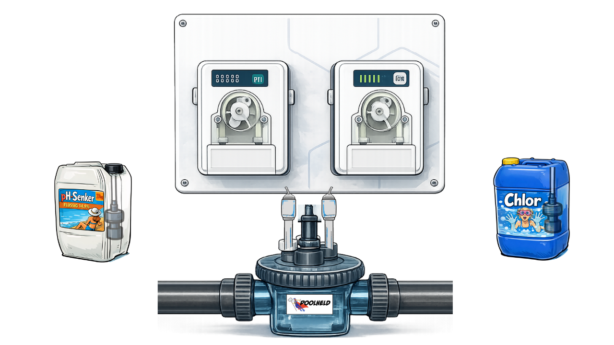

# TomTuT Pool Dosing Vigipool Card

[](https://github.com/hacs/integration)
[](https://github.com/TomTuTHub/tomtut-pool-dosing-vigipool-card/releases/latest)
[](https://www.home-assistant.io/)
[](LICENSE)



Custom Lovelace Dashboard Card für die **[TomTuT Pool Dosing Vigipool Integration](https://github.com/TomTuTHub/tomtut-pool-dosing-vigipool)** (Vigipool Orpheo VP — Phileo VP + Oxeo VP). Zeigt pH-Wert, Redox-Wert, Pumpenstatus, Firmware-Version, Wasserfluss und ein Settings-Overlay (Sollwerte / Behälter / Restmenge / Modi) an.

> **Disclaimer:** Dieses Projekt ist nicht affiliiert mit Vigipool, CCEI oder Poolsana. Nutzung auf eigene Verantwortung.

---

## Features

- **pH- und Redox-Werte** — Live-Anzeige der aktuellen Messwerte direkt auf der Card
- **Animierter Wasserfluss** — Animierte Wellendarstellung, automatisch ausgegraut wenn Durchfluss aus
- **Animierte Pumpen** — Drehen wenn die jeweilige Pumpe (pH / Chlor) aktiv injiziert
- **Zahnrad-Badge** (oben rechts) — öffnet ein Settings-Overlay mit allen R/W-Entities
  - Sollwerte (pH / ORP)
  - Behältergrößen (pH / Chlor)
  - Maximaldosis pro Tag (pH / Chlor)
  - Restmenge im Kanister (pH / Chlor)
  - Spa- und Winter-Modus
- **Zwei Smart-Plug Badges** — für pH- und Chlor-Steckdose mit unabhängigen Positionen
- **Visueller Editor** — Kompletter GUI-Editor, keine YAML-Kenntnisse nötig
- **Vollständig anpassbar** — Positionen, Größen und Farben aller Elemente individuell einstellbar

---

## Voraussetzungen

- Home Assistant **2026.3.0** oder neuer
- [HACS](https://hacs.xyz/) installiert
- **[TomTuT Pool Dosing Vigipool Integration](https://github.com/TomTuTHub/tomtut-pool-dosing-vigipool)** installiert und konfiguriert

> **Wichtig:** Die Integration muss **zuerst** installiert sein — sie stellt die Sensoren bereit, die diese Card anzeigt.

---

## Installation

### Via HACS (empfohlen)

Die Card ist im **HACS-Standardkatalog** — ein benutzerdefiniertes Repository ist nicht nötig.

1. HACS in Home Assistant öffnen
2. Nach **TomTuT Pool Dosing Vigipool Card** suchen und **Herunterladen**
3. Browser neu laden

### Manuelle Installation

1. `tomtut-pool-dosing-vigipool-card.js` herunterladen
2. Nach `config/www/community/tomtut-pool-dosing-vigipool-card/` in der Home Assistant Instanz kopieren
3. In HA: **Einstellungen → Dashboards → Ressourcen** → Ressource hinzufügen:
   - URL: `/local/community/tomtut-pool-dosing-vigipool-card/tomtut-pool-dosing-vigipool-card.js`
   - Ressourcentyp: **JavaScript-Modul**
4. Browser neu laden

> Das Hintergrundbild (`dosieranlage.png`) wird automatisch von der Integration ausgeliefert (Endpunkt `/api/tomtut_pool_dosing_vigipool/static/dosieranlage.png`) — es muss nicht separat heruntergeladen oder nach `www/` kopiert werden.

---

## Konfiguration

Die Card im Dashboard-Editor hinzufügen: **Karte hinzufügen** → **TomTuT Pool Dosing Vigipool** auswählen. Der visuelle Editor öffnet sich automatisch.

### Grundeinstellungen

| Option | Pflicht | Beschreibung |
|---|---|---|
| `device_name` | Ja* | Name der Dosieranlage in HA (z.B. `Orpheo VP Pool Dosieranlage`) — die Card sucht sich die passenden Entities selbst |
| `entity_prefix` | Ja* | Nur nötig, wenn die Automatik daneben liegt: Entity-Präfix direkt setzen (z.B. `sensor.orpheo_vp_pool_dosieranlage`) |
| `image_variant` | Nein | Bildvariante: `weiss`, `schwarz` oder `transparent` (Standard) |
| `plug_entity_ph` | Nein | Entity-ID einer Steckdose für die pH-Pumpe |
| `plug_entity_rx` | Nein | Entity-ID einer Steckdose für die Redox-/Chlor-Pumpe |
| `show_settings` | Nein | Zahnrad-Badge ein/aus (Standard: ein) |

\* Mindestens eine der beiden Optionen `device_name` oder `entity_prefix` ist Pflicht.

### YAML-Beispiel

```yaml
type: custom:tomtut-pool-dosing-vigipool-card
device_name: Orpheo VP Pool Dosieranlage
plug_entity_ph: switch.steckdose_ph
plug_entity_rx: switch.steckdose_chlor
```

### Erweiterte Einstellungen

Im visuellen Editor unter **Erweiterte Einstellungen** können alle Positionen, Größen und Farben angepasst werden — Wasserfluss, Pumpen, Firmware-Anzeige, Messwerte, Plug-Positionen.

---

## Wenn die Card "Sensor ... nicht gefunden" meldet

Die Card leitet den Entity-Präfix aus dem **Namen** der Dosieranlage ab und prüft ihn gegen die
tatsächlich vorhandenen Entities. Findet sie nichts Passendes, sagt sie das — zusammen mit der
Entity-ID, die sie erwartet hat.

Meistens weicht die Entity-ID vom Namen ab, weil Home Assistant beim Umwandeln strenger ist
(Umlaute werden transliteriert, Bindestriche/Punkte/Klammern werden zu `_`) oder weil nach einer
Neuinstallation ein `_2` angehängt wurde. Beides erkennt die Card inzwischen selbst. Bleibt die
Meldung trotzdem stehen:

1. **Entwicklerwerkzeuge → Zustände** öffnen und nach `_ph` filtern
2. Die vollständige Entity-ID des pH-Sensors ablesen, z.B. `sensor.orpheo_vp_pool_dosieranlage_ph`
3. Im Card-Editor unter **Entity-Präfix** alles **ohne** das abschließende `_ph` eintragen —
   hier also `sensor.orpheo_vp_pool_dosieranlage`

Existiert die Entity dort zwar, zeigt aber `unavailable` oder `unknown`, liegt es nicht an der
Card: dann empfängt die Integration selbst gerade keine Daten — die Card meldet in dem Fall
"Anlage offline".

---

## Verwendete Entities

Die Card erwartet folgende Entity-Suffixe (relativ zum `entity_prefix`):

| Entity | Beschreibung |
|---|---|
| `sensor.*_ph` | pH-Wert |
| `sensor.*_orp_redox` | Redox-Wert (mV) |
| `sensor.*_ph_firmware` | Firmware-Version |
| `binary_sensor.*_durchfluss` | Wasserdurchfluss aktiv |
| `binary_sensor.*_ph_dosierpumpe` | pH-Pumpe aktiv |
| `binary_sensor.*_chlor_dosierpumpe` | Chlor-Pumpe aktiv |
| `number.*_ph_sollwert` | pH-Sollwert (R/W) |
| `number.*_orp_sollwert` | ORP-Sollwert (R/W) |
| `number.*_ph_behaeltergroesse` | pH-Behältergröße (R/W) |
| `number.*_chlor_behaeltergroesse` | Chlor-Behältergröße (R/W) |
| `number.*_ph_maximaldosis_tag` | pH max. Tagesdosis (R/W) |
| `number.*_chlor_maximaldosis_tag` | Chlor max. Tagesdosis (R/W) |
| `number.*_ph_restmenge` | pH Kanister-Restmenge (R/W) |
| `number.*_chlor_restmenge` | Chlor Kanister-Restmenge (R/W) |
| `switch.*_spa_modus` | Spa-Modus (R/W) |
| `switch.*_winter_modus` | Winter-Modus (R/W) |

Alle werden von der **[TomTuT Pool Dosing Vigipool Integration](https://github.com/TomTuTHub/tomtut-pool-dosing-vigipool)** automatisch bereitgestellt.

---

## Support & Issues

Bugs und Feature-Requests bitte hier melden:
[https://github.com/TomTuTHub/tomtut-pool-dosing-vigipool-card/issues](https://github.com/TomTuTHub/tomtut-pool-dosing-vigipool-card/issues)

---

## Lizenz

MIT License — siehe [LICENSE](LICENSE) für Details.

---

## Über den Autor

Ich bin ausgebildeter Fachinformatiker für Systemintegration mit langjähriger IT-Erfahrung. Früher war es der MCSE — heute ist es Vibe Coding. Diese Card wurde mit Hilfe von Claude gebaut. Ohne KI-Unterstützung hätte ich das nebenbei nie in dieser Form hinbekommen. Der Code wurde von mir getestet und läuft in meinem eigenen Produktiv-Setup.

Mehr auf [tomtut.de](https://tomtut.de) und [YouTube @TomTuT](https://www.youtube.com/@TomTuT).

---

Das war TomTuT, bleib hart am Gas.
